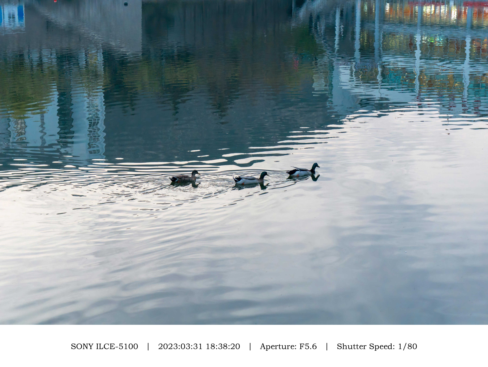

# Border-Watermark 边框水印

Border Watermark (边框水印) adds a white border waterwark at the bottom of each of your photo.

The text displayed in the watermark includes EXIF information read from the photo: shooting device, shooting time, shutter speed and aperture.

Various sizes are supported.

边框水印可以批量为你的照片添加一个底部的白色边框水印。

水印内容包括从照片中读取的EXIF信息：拍摄设备、拍摄时间、快门速度、光圈。

支持多种照片尺寸。

## 效果展示




## 运行说明

Please install these python packages via `pip install`:
请通过 `pip install`安装有关python环境：

```
from PIL import Image, ImageDraw, ImageFont
import exifread
import math
import os
from tqdm import tqdm
```
